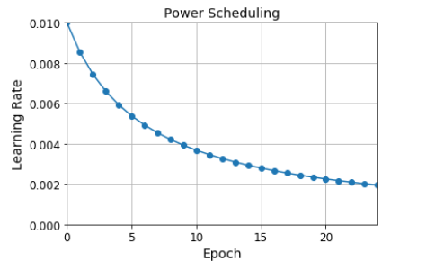
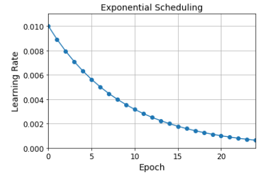
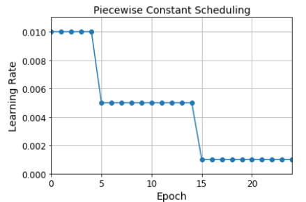
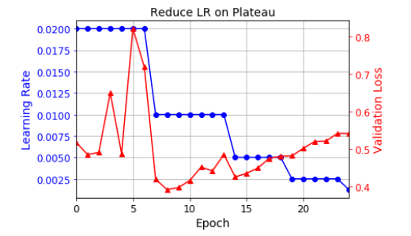
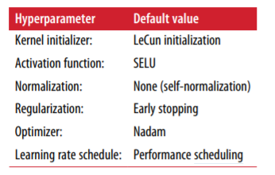

| 超参数类型 | 默认值                                 |
| ---------- | -------------------------------------- |
| 初始化     | He初始化                               |
| 激活函数   | ELU                                    |
| 归一化     | 浅层网络：不需要；深度网络：批量归一化 |
| 正则化     | 提前停止（如果需要，可加l2)            |
| 优化器     | 动量优化(or RMSProp or Nadam)          |
| 学习率调度 | 1周期                                  |

| 超参数类型 | 默认值                        |
| ---------- | ----------------------------- |
| 初始化     | Lecun初始化                   |
| 激活函数   | SELU                          |
| 归一化     | 不需要                        |
| 正则化     | 如果需要：alpha dropout       |
| 优化器     | 动量优化(or RMSProp or Nadam) |
| 学习率调度 | 1周期                         |
